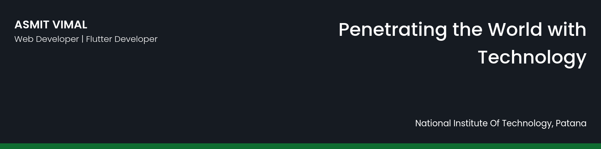

 

<h1 align="center">Hi 👋, I'm Asmit Vimal</h1>  
<h3 align="center">Student at National Institute of Technology Patna</h3>  
  
- 🔭 I’m currently working on [CRED Escapes](https://cred.club/escapes)  
  
- 🌱 I’m currently learning **Flutter, MERN, Data Science, DSA.**  
  
- 👨‍💻 All of my projects are available at [https://viasmit.github.io/](https://viasmit.github.io/)  
  
- 💬 Ask me about **MongoDB, ReactJS, AngularJS, Express, Node, Flutter, Python, Django, Data Science, Competitive Programming**  
  
- 📫 How to reach me **asmit.vml.962@gmail.com**  
  
- 📄 Know about my experiences - [Resume](https://drive.google.com/file/d/1SKpN8uXCMRd9l04B1GJWxYnHUakF8Qkr/view?usp=sharing)  
  
- ⚡ Fun fact **Nothing Keeps me down, except gravity ;)**  

 

  

 ## 📊 My Github Stats

    

   
  <b>Note:</b> Top languages is only a metric of the languages my public code consists of and doesn't reflect experience or skill level.

 
 

 
 
  
<h3 align="left">Connect with me:</h3>  

  
  
  
  
  

  
  
  
  
  

  
 
<h3 align="left">Languages and Tools:</h3>  

                                     
  

## Trophies
  

 

  
 

  
